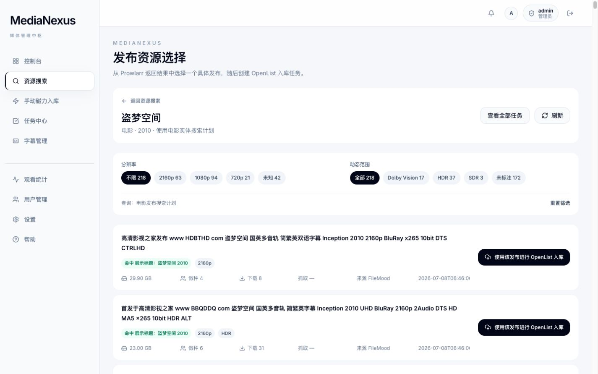
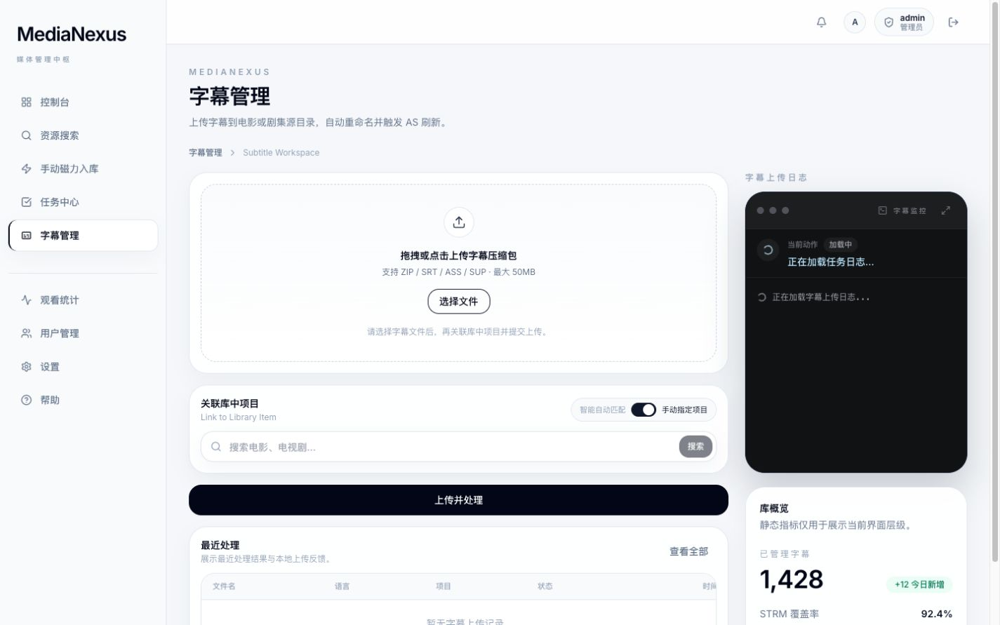

# MediaNexus-Orchestrator Java 后端

`MediaNexus-Orchestrator` 是 MediaNexus 的 Java 后端项目，用于承载新的资源搜索、发布资源选择、OpenList 入库编排、任务中心、失败恢复、字幕上传、动漫订阅和管理端能力。

MediaNexus 本身是 Emby 分享工作流上层的管理与编排站点，不替代 CD2、AutoSymlink、Emby、VidHub、Prowlarr、Sonarr、Radarr、OpenList、PikPak、Ani-RSS 或外部资源网站。

## 当前定位

Java 后端负责把前端用户动作转成稳定的后端编排能力：

- 账号注册、登录、登出、当前用户会话。
- 普通用户每日创建额度限制。
- 电影和剧集目录搜索。
- Prowlarr 发布资源搜索与推荐。
- 电影、剧集、动漫整季 OpenList 入库任务创建。
- 手动 magnet 入库和失败任务恢复。
- 任务中心聚合查询、日志查询和任务尝试链。
- 动漫 Mikan 搜索、字幕组预览和 Ani-RSS 追更订阅。
- 字幕上传、上传日志和后续处理状态查询。
- 部分管理端能力，例如用户、注册码、AutoSymlink 刷新、观看统计和 Adult 相关编排。

## 用户流程对应关系

### 资源搜索

前端先通过目录搜索确认电影或剧集条目，再进入推荐入库或查看更多。


相关接口：

- `GET /api/v1/resources/movies/search`
- `GET /api/v1/resources/series/search`
- `GET /api/v1/resources/series/seasons`
- `GET /api/v1/resources/anime/search`

### 自动发布推荐

用户点击卡片上的入库按钮后，后端会搜索并返回推荐发布资源。前端展示确认弹窗，用户确认后才创建 OpenList 入库任务。


相关接口：

- `POST /api/v1/resources/movies/releases/recommendation`
- `POST /api/v1/resources/series/releases/recommendation`
- `POST /api/v1/resources/movies/releases/openlist-ingest`
- `POST /api/v1/resources/series/releases/openlist-ingest`

推荐结果会保留发布标题、分辨率标签、动态范围标签、季数标签、体积、做种、下载、抓取和索引器来源。推荐规则面向用户时只需要解释为：优先考虑标题相关、清晰度匹配、健康度较好、动态范围合适且更容易成功的发布资源。

### 发布资源选择

用户点击“查看更多”时，前端进入发布资源选择页，后端返回 Prowlarr 发布搜索结果。



相关接口：

- `POST /api/v1/resources/movies/releases/search`
- `POST /api/v1/resources/series/releases/search`
- `GET /api/v1/resources/releases/search`

发布搜索可能需要十几秒，慢时可能接近 30 秒。调用方不应因为几秒未返回就重复提交同一个搜索。

### 任务中心和失败恢复

任务中心聚合展示 OpenList 入库任务。失败、中断或部分完成任务可以通过重新选择发布资源、复用原 magnet 或替换 magnet 创建新的任务尝试。


相关接口：

- `GET /api/v1/task-center/openlist-ingest/tasks`
- `GET /api/v1/task-center/openlist-ingest/tasks/{taskType}/{taskId}`
- `GET /api/v1/task-center/openlist-ingest/tasks/{taskType}/{taskId}/logs`
- `GET /api/v1/task-center/openlist-ingest/tasks/{taskType}/{taskId}/release-retry-context`
- `POST /api/v1/task-center/openlist-ingest/tasks/{taskType}/{taskId}/release-retries`
- `POST /api/v1/task-center/openlist-ingest/tasks/{taskType}/{taskId}/manual-magnet-retries/reuse-original`
- `POST /api/v1/task-center/openlist-ingest/tasks/{taskType}/{taskId}/manual-magnet-retries/replace-magnet`

任务重试不会覆盖原任务日志，而是创建新的任务尝试。前端据此展示同一入库意图下的第一次、第二次和后续尝试。

### 字幕上传

资源入库只解决视频文件进入媒体库，不保证发布资源一定自带合适中文字幕。用户可以在播放后发现缺字幕、语言不对或时间轴不匹配时，再通过字幕管理上传字幕。



相关接口：

- `POST /api/v1/subtitles/uploads`
- `GET /api/v1/subtitles/uploads`
- `GET /api/v1/subtitles/uploads/{uploadId}`
- `GET /api/v1/subtitles/uploads/{uploadId}/logs`

## 外部工具与来源边界

- SeedHub：https://www.seedhub.cc/
  可作为手动 magnet 来源之一。用户复制 magnet 前需要自行核对作品、年份、季集、清晰度、体积、字幕信息和做种情况。
- SubHD：https://subhd.tv/
  可作为字幕来源之一。用户下载字幕前需要自行核对片名、年份、季集、版本组、片长和帧率。
- Prowlarr：用于发布资源搜索和索引器聚合。
- OpenList：用于离线下载和入库执行。
- Ani-RSS：用于动漫追更订阅。

后端会保存或返回足够的来源上下文，例如发布标题、索引器、分辨率、动态范围和任务来源，但不会替外部资源站或字幕站保证内容正确。

## 技术栈

- Java 17
- Spring Boot 3.x
- Maven
- MySQL 8
- MyBatis-Plus
- Sa-Token
- BCrypt
- Knife4j / OpenAPI

## 配置

默认配置位于 `src/main/resources/application.yml`。本地机密可以放在 `.env`，Spring Boot 会自动导入，且 `.gitignore` 已避免提交该文件。

常用环境变量：

```bash
MEDIANEXUS_DB_URL='jdbc:mysql://127.0.0.1:3307/medianexus_orchestrator?useUnicode=true&characterEncoding=utf8&useSSL=false&allowPublicKeyRetrieval=true&serverTimezone=Asia/Shanghai'
MEDIANEXUS_DB_USERNAME='TEC'
MEDIANEXUS_DB_PASSWORD='...'
MEDIANEXUS_ANI_RSS_BASE_URL='http://example.invalid:7789'
MEDIANEXUS_ANI_RSS_API_KEY=''
MEDIANEXUS_ANI_RSS_TIMEOUT='10s'
MEDIANEXUS_AUTH_REGISTRATION_CODE='your-registration-code'
MEDIANEXUS_DAILY_CONTENT_CREATE_LIMIT=3
```

生产环境使用：

```bash
SPRING_PROFILES_ACTIVE=prod
```

生产 profile 会关闭 Knife4j/OpenAPI，并在启动时检查危险的默认 datasource 或 SSH tunnel 配置。

## 数据库连接

如果 MySQL 只在远端服务器本机环回地址暴露，可以先手动建立 SSH tunnel：

```bash
ssh -L 3307:127.0.0.1:3306 root@YOUR_SERVER_HOST
```

也可以在 `.env` 中启用内置 OpenSSH tunnel：

```bash
MEDIANEXUS_DB_SSH_TUNNEL_ENABLED=true
MEDIANEXUS_DB_SSH_HOST=YOUR_SERVER_HOST
MEDIANEXUS_DB_SSH_USERNAME=root
MEDIANEXUS_DB_SSH_PASSWORD='...'
```

Docker 内部网络部署时通常关闭 tunnel，并把 datasource 指向 MySQL 服务名：

```bash
MEDIANEXUS_DB_SSH_TUNNEL_ENABLED=false
MEDIANEXUS_DB_URL='jdbc:mysql://mysql:3306/medianexus_orchestrator?useUnicode=true&characterEncoding=utf8&sslMode=DISABLED&allowPublicKeyRetrieval=true&serverTimezone=Asia/Shanghai'
```

这里的 MySQL 服务仅通过受信任的 Docker 内部网络访问。非 TLS 连接使用
`caching_sha2_password` 时，Connector/J 需要通过
`allowPublicKeyRetrieval=true` 获取服务端 RSA 公钥完成密码交换。

## 本地启动

```bash
mvn spring-boot:run
```

默认端口为 `8080`。

项目约定：后端启动、停止通常由用户负责。需要看错误时，优先读取：

```bash
tail -n 200 logs/dev-run.log
```

## 健康检查

```bash
curl http://localhost:8080/api/v1/health
```

期望响应：

```json
{
  "code": 200,
  "message": "success",
  "data": {
    "status": "UP",
    "service": "MediaNexus-Orchestrator"
  }
}
```

## 认证 API

除 `POST /api/v1/auth/register`、`POST /api/v1/auth/login` 和 `GET /api/v1/health` 外，`/api/**` 默认需要：

```text
Authorization: Bearer YOUR_TOKEN
```

示例：

```bash
curl -X POST http://localhost:8080/api/v1/auth/login \
  -H 'Content-Type: application/json' \
  -d '{"account":"tengen","password":"ChangeMe123"}'

curl http://localhost:8080/api/v1/auth/me \
  -H 'Authorization: Bearer YOUR_TOKEN'

curl -X POST http://localhost:8080/api/v1/auth/logout \
  -H 'Authorization: Bearer YOUR_TOKEN'
```

注册和登录返回：

```json
{
  "code": 200,
  "message": "success",
  "data": {
    "token": "YOUR_TOKEN",
    "user": {
      "id": 1,
      "username": "tengen",
      "email": "tengen@example.com",
      "role": "USER",
      "created_at": "2026-06-09T12:00:00"
    }
  }
}
```

密码以 BCrypt hash 存储。需要手动准备管理员账号时，可以生成 hash 后写入数据库：

```bash
htpasswd -bnBC 10 "" 'ChangeMe123' | tr -d ':\n'
```

```sql
INSERT INTO users (username, email, password_hash, user_role)
VALUES ('admin', 'admin@example.com', '<BCrypt hash from htpasswd>', 'ADMIN');
```

## 每日额度

普通用户创建内容相关任务前需要登录。以下动作共享每日额度：

- `MAGNET_INGEST_CREATE`
- `ANIME_SUBSCRIBE_CREATE`

默认每人每天 3 次，可通过 `MEDIANEXUS_DAILY_CONTENT_CREATE_LIMIT` 调整。管理员不受限制。

达到上限时返回 HTTP 429：

```json
{
  "code": 429,
  "message": "今日创建次数已达上限，请明天再试",
  "data": null
}
```

## API 文档

本地开发默认启用 Knife4j/OpenAPI：

- `http://localhost:8080/doc.html`
- `http://localhost:8080/swagger-ui.html`

登录后把返回的 `token` 填入 docs 页面的 `Authorize` / `BearerAuth`。该输入框只填原始 token；如果使用调试面板里的 `Authorization` 请求头字段，则填写完整值：

```text
Bearer <token>
```

`prod` 或 `production` profile 下默认禁用 API 文档。

## 验证约定

本仓库默认不运行全项目构建、全量测试或全量校验。改动文档时无需启动后端；改动接口或编排逻辑时，优先做最小相关验证，并先查看 `logs/dev-run.log` 中的现有启动和错误输出。
